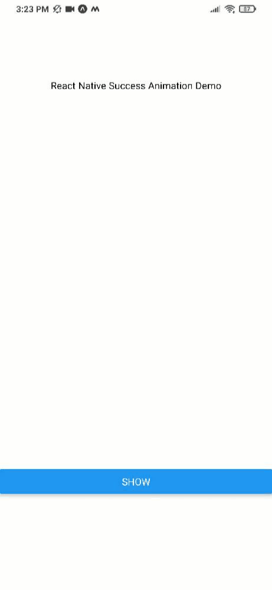

# Success Animation

react native component success animation is for react native developers.This npm is for people who can not work with lottie animation for animations.This npm module is completly customizable.hope this helps lot of us make your project even more cooler.

Note: Feel free to raise issues and ask for new features. 

## Table of Contents

- [Installation](#installation)
- [Import](#import)
- [Usage](#usage)
- [Demo](#demo)

- [Props table](#props)
- [Support](#support)
- [Contributing](#contributing)

## Installation

`npm install react-native-success-animation`

## Import

`import { SuccessAnimation} from react-native-success-animation`

## Usage

```javascript
import React, { useState } from "react";
import { View, Text, Button } from "react-native";
import { SuccessAnimation } from "react-native-success-animation";

const App = () => {
  const [state, setState] = useState(false);
  return (
    <View style={{ flex: 1 }}>
      <View
        style={{ flex: 0.3, justifyContent: "center", alignItems: "center" }}
      >
        <Text>React Native Success Animation Demo</Text>
      </View>
      <View
        style={{ flex: 0.5, justifyContent: "center", alignItems: "center" }}
      >
        {state && (
          <SuccessAnimation
            size={120}
            iconSize={120 * 0.7}
            dotColor={"#44c6b1"}
            iconColor={"white"}
            dotSize={20}
            duration={2000}
            backgroundColor={"#44c6b1"}
            animatedLayerColor={"white"}
            onAnimationEnd={() => alert("Animation Ended")}
          />
        )}
      </View>
      <View style={{ flex: 0.2 }}>
        <Button
          title={state ? "Hide" : "Show"}
          onPress={() => setState((prevState) => !prevState)}
        />
      </View>
    </View>
  );
};

export default App;
```

## Demo

[Click here to navigate to snack code example]("https://snack.expo.io/@vijaydemonz/react-native-liquid-progress")

**note**:its not comptaible for react-native web yet;



## Props table

| **prop**        | **description**                                                                 | **default** | **type**      | **required** |
| --------------- | ------------------------------------------------------------------------------- | ----------- | ------------- | ------------ |
| `size`    | Size of success Animation component | 120     | Number       | yes          |
| `iconSize`| Check icon Size | 84         | Number        | yes          |
| dotColor  | color for particles in animation| #44c6b1     | hexcolor     | no           |
| iconColor | icon color (check icon)       |   #ffff       | hexcolor     | no           |
| dotSize   | particle size                 |   #44c6b1     | hexcolor     | no           |
| `duration`| duration for animation to last|   2000        | milliseconds | yes           |
| backgroundColor| background color for animation(check icon background)| #44c6b1 | hexcolor | no           |
| animatedLayerColor| animated face layer (leave it as default for best experience)| #ffff | hexcolor | no           |
| onAnimationEnd | trigger event when animation is complete | null | function | no |

## Support

Please [open an issue](https://github.com/vijaydemonz/react-native-success-animation-npm/issues/new) for support.

## Contributing

Please contribute using [Github Flow](https://guides.github.com/introduction/flow/). Create a branch, add commits, and [open a pull request](https://github.com/vijaydemonz/react-native-success-animation-npm/compare/).